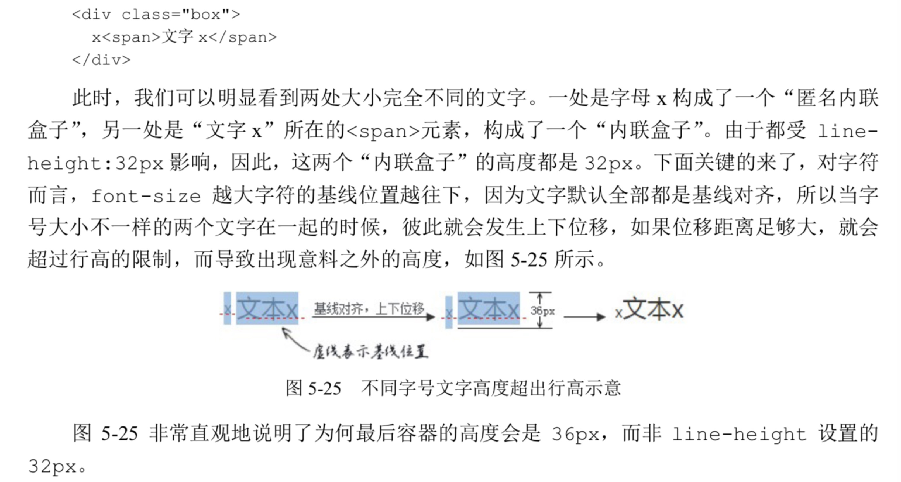

```
1.外在盒子负责元素是可以一行显示，还是只能换行显示;内在盒子负责 宽高、内容呈现什么的。但是呢，造物主又想了想，叫“内在盒子”虽然容易理解，但是未免 有些俗气，难登大雅之堂，于是，又想了一个更专业的名称，叫作“容器盒子”。

2 按照 display 的属性值不同，值为 block 的元素的盒子实际由外在的“块级盒子” 和内在的“块级容器盒子”组成，
   值为 inline-block 的元素则由外在的“内联盒子”和内 在的“块级容器盒子”组成，值为 inline 的元素则内外均是“内联盒子”

3.设置 display:block 使其块状化绝对没有问 题，但后面的 width:100%就没有任何出现的必要了。
   为何要“无宽度”? 原因很简单，表现为“外部尺寸”的块级元素一旦设置了宽度，流动性就丢失了。
   所谓流动性，并不是看上去的宽度 100%显示这么简单，而是一种 margin/border/padding 和 content 内容区域自动分配水平空间的机制。  

4.!important 的权重比直接在元素的 style 属性中设置 CSS 声明还要高， 一般用在 CSS 覆盖 JavaScript 设置上。但是，就是这么厉害的!important，直接被 max-width 一 个浪头就拍沉了。比方说，针对下面的 HTML 和 CSS 设置，图片最后呈现的宽度是多少呢?
    
    img { max-width: 256px; }
答案是 256px。style、!important 通通靠边站!因为 max-width 会覆盖 width  

5.替换元素的尺寸从内而外分为 3 类:固有尺寸、HTML 尺寸和 CSS 尺寸;
  固有尺寸指的是替换内容原本的尺寸。
  HTML 尺寸这个概念略微抽象，“HTML 尺寸”只能通过HTML 原生属性改变，这些 HTML 原生属性包括的 width 和 height 属性、<input> 的 size 属性、<textarea>的 cols 和 rows 属性等。
  CSS 尺寸特指可以通过 CSS 的 width 和 height 或者 max-width/min-width 和 max-height/min-height 设置的尺寸，对应盒尺寸中的 content box。

  如果没有 CSS 尺寸和 HTML 尺寸，则使用固有尺寸作为最终的宽高。
  如果没有 CSS 尺寸，则使用 HTML 尺寸作为最终的宽高。
  如果有 CSS 尺寸，则最终尺寸由 CSS 属性决定。
  如果“固有尺寸”含有固有的宽高比例，同时仅设置了宽度或仅设置了高度，则元素依 然按照固有的宽高比例显示。
  如果上面的条件都不符合，则最终宽度表现为300像素，高度为150像素，宽高比2:1,img例外；
  内联替换元素和块级替换元素使用上面同一套尺寸计算规则.

6.默认空<div>高度是 0，但是一旦里面写上几个文字，<div>高度 就有了，这个高度本质上是由 line-height 属性全权决定的，
尽管某些场景确实与 font-size 大小有关。

对于非替换元素的纯内联元素，其可 视高度完全由 line-height 决定;注意这里的措辞— “完全”，什么 padding、border 属性对可视高度是没有任何影响的，
这也是我们平常 口中的“盒模型”约定俗成说的是块级元素的原因。
line-height 不会影响替换元素(如图片的高度),
对于块级元素，line-height 对其本身是没有任何作用的，我们平时改变 line-height， 块级元素的高度跟着变化实际上是通过改变块级元素里面内联级别元素占据的高度实现的。

7. vertical-align 属性只能作用在 display 计算值为 inline、inline- block，inline-table 或 table-cell 的元素上。

虽然就效果而言，table-cell 元素设置 vertical-align 垂 直对齐的是子元素，但是其作用的并不是子元素，而是 table-cell 元素自
身。就算 table-cell 元素的子元素是一个块级元素，也一样可以让其有各 种垂直对齐表现。

vertical-align 的默认值是 baseline，即基线对齐，而基线的定义是字母 x 的 下边缘。因此，内联元素默认都是沿着字母 x 的下边缘对齐的。
对于图片等替换元素，往往使 用元素本身的下边缘作为基线,由于是相对字母 x 的下边缘对齐，而中文和部分英文字形的下边缘要低于字母 x 的下边缘，
因 此，会给人感觉文字是明显偏下的，一般都会进行调整。
vertical-align 属性值为数值百分比类时，根据计算值的不同，相对于基线往上或往下偏移，到底是往上还是往下
取决于 vertical- align 的计算值是正值还是负值，如果是负值，往下偏 移，如果是正值，往上偏移，而且数值大小全部都是相对于基线位置计算的，因此，从这一点来看，vertical-align:baseline 等同于 vertical-align:0。

在 CSS 世界中，凡是百分比值，均是需要一个相对计算的值，例如，margin 和 padding 是相对于宽度计算的，line-height 是相对于 font-size 计算的，而这里的 vertical- align 属性的百分比值则是相对于 line-height 的计算值计算的。可见，CSS 世界中的各类 属性相互间有着紧密联系而非孤立的个体。

 <div class="box">
      
    </div>
    .box > img {
      height: 96px;
      margin-top: -200px;
}
此时，按照理解，-200px 远远超过图片的高度，图片应该完全跑到容器的外面，但是， 图片依然有部分在.box 元素中，而且就算 margin-top 设置成-99999px，图片也不会继续 往上移动，完全失效。其原理和上面图片底部留有间隙实际上是一样的，图片的前面有个“幽 灵空白节点”，而在 CSS 世界中，非主动触发位移的内联元素是不可能跑到计算容器外面的， 导致图片的位置被“幽灵空白节点”的 vertical-align:baseline 给限死了。我们不妨把 看不见的“幽灵空白节点”使用字符 x 代替，
原因就一目了然了。因为字符 x 下边缘和图片下边缘对齐，字符 x 非主动定位，不可能跑到容器外面，所以图片就被限死在此问题，margin-top失效。
```


### inline-block 与 baseline
```
vertical-align 属性的默认值 baseline 在文本之类的内联元素那里就是字符 x 的下 边缘，对于替换元素则是替换元素的下边缘。但是，如果是 inline-block 元素，则规则要 复杂了:一个 inline-block 元素，如果里面没有内联元素，或者 overflow 不是 visible， 则该元素的基线就是其 margin 底边缘;否则其基线就是元素里面最后一行内联元素的基线
```
[inline-block 与 baseline](./valign.html)

###  content 与替换元素关系剖析
```
CSS 世界中，我们把 content 属性生成的对象称为“匿名替换元素”(anonymous replaced element)。 
content 属性生成的内容都是替换元素?没错，就是替换元素!
也正是这个原因，content 属性生成的内容和普通元素内容才会有很多不同的特性表现。  

 我们使用 content 生成的文本是无法选中、无法复制的，好像设置了 user- select:none 声明一般，但是普通元素的文本却可以被轻松选中。同时，content 生成的文 本无法被屏幕阅读设备读取，也无法被搜索引擎抓取
```
### float
```
float 属性让父元素高度塌陷的原因就是为了实现文字环绕效果。
“高度塌陷”只是让跟随的内容可以和浮动元素在一个水平线上，但这只是实现“环 绕效果”的条件之一，要想实现真正的“环绕效果”，就需要另外一个平时大家不太在意的特性， 那就是“行框盒子和浮动元素的不可重叠性”，也就是“行框盒子如果和浮动元素的垂直高度有 重叠，则行框盒子在正常定位状态下只会跟随浮动元素，而不会发生重叠”。
注意，这里说的是“行框盒子”，也就是每行内联元素所在的那个盒子，而非外部的块状 盒子。实际上，由于浮动元素的塌陷，块状盒子是和图片完全重叠的，

```
### clip
```
rect(top right bottom left)
top right bottom left分别指最终剪裁可见区域的上边，右边，下边与左边。而所有的数值都表示位置，且是相对于原始元素的左上角而言;
rect(30px 200px 200px 20px)
表示的含义就是：最终剪裁的矩形的上边距离原始元素的上边缘30像素；剪裁矩形的右边缘距离原元素左边缘的距离是200像素；剪裁矩形的下边缘距离原元素顶部的距离为200像素；剪裁矩形的左边缘距离原元素左边缘的距离时20像素。
```
[clip](https://www.zhangxinxu.com/study/201103/css-rect-demo.html)
###  ex
```
虽然说 em、px 这类单位的主要作用是限定元素的尺寸，但是，由于字母 x 受字体 等 CSS 属性影响大，不稳定，因此 ex 不太适合用来限定元素的尺寸。那问题来了:ex 连自己 的本职工作都做不好，难道还指望其副业开挂?
没错，ex 的价值就在其副业上— 不受字体和字号影响的内联元素的垂直居中对齐 效果。
我们都知道，内联元素默认是基线对齐的，而基线就是 x 的底部，而 1ex 就是一个 x 的高 度。设想一下，假如图标高度就是 1ex，同时背景图片居中，岂不是图标和文字天然垂直居中， 而且完全不受字体和字号的影响?因为 ex 就是一个相对于字体和字号的单位

```
### font-style
italic 是使用当前字体的斜体字体，而 oblique 只是单纯地让文字倾斜。
### font-face
```
  @font-face {
      font-family: ICON;
      src: url('icon.eot') format('eot');
      src: url('icon.eot?#iefix') format('embedded-opentype'),
          url('icon.woff2') format("woff2")
          url('icon.woff') format("woff"),
          url('icon.ttf') format("typetrue"),
          url('icon.svg#icon') format('svg');
      font-weight: normal;
      font-style: normal;
    }
 svg 格式是为了兼容 iOS 4.1 及其之前的版本，考虑到现如今 iOS 的版本数已经翻了一 番，所以 svg 格式的兼容代码大可舍弃。
 eot 格式是 IE 私有的。注意，目前所有版本的 IE 浏览器都支持 eot 格式，并不是只 有 IE6~IE8 支持。只是，IE6~IE8 仅支持 eot 这一种字体格式。
 woff 是 web open font format 几个词的首字母简写，是专门为 Web 开发而设计的字体格式，显然是优先使用的字体格式，其字体尺寸更小，加载更快。Android 4.4 开始全 面支持。
 woff2 是比 woff 尺寸更小的字体，小得非常明显。因此，Web 开发第一首选字体就 是 woff2，只是此字体目前仅 Chrome 和 Firefox 支持得比较好。
ttf 格式作为系统安装字体比较多，Web 开发也能用，就是尺寸大了点儿，优点在于 老版本 Android 也支持。

这里的#iefix 确实没什么用，真正有用的其实是前面的问号。是这样的，IE9 之前的版本解析有一个严重的问题，当 src 属性包含多个 url()时，会把长长的字符当作一个地址解析而返回 404 错误。因此把 eot 格式放在第一位，然后在字体文件 url 地址后加上问号，这样 IE9 之前的版本会把问号之后 的内容当作 url 的参数。好吧，#iefix 严格来说还是有点儿用的，它可以让请求地址短一 些，因此请求地址是不包括锚点标志#及其后面的内容的。

“为什么需要两个 src”这个问题了。如果是原生的 IE7 和 IE8 浏览器，第一个src 实际上是多余的，为什么这么讲呢?
之所以要放上来，很大一部分原因是为了测试工程师。 因为现在测试工程师测试低版本的 IE 浏览器喜欢使用兼容模式，兼容模式的 IE 和原生同版本 的 IE 的解析是有区别的，其中区别之一就是兼容模式的 IE7 和 IE8 不认识问号(?)解决方案， 导致第二个 src 无法识别，不得已才多了第一行的 src。

font-weight:normal 和 font-style:normal 是不是多余的?我的回答是，如果你 没有同字体名的多字体设置，则它就是多余的，至少我在常规项目中删掉这两行 CSS 没有出现 任何异常。
最后的问题是:format()功能符有什么作用，可不可以省略?我的回答是最好不要省略。 format()功能符的作用是让浏览器提前知道字体的格式，以决定是否需要加载这个字体，而 不是加载完了之后再自动判断。
```
### text-align:justify
```
在默认设置下，text-align:justify 要想有两端对齐的效果，需
要满足两点:一是有分隔点，如空格;二是要超过一行，此时非最后一行内容会两端对齐。
```
### background-position
positionX = (容器的宽度 - 图片的宽度) * percentX; positionY = (容器的高度 - 图片的高度) * percentY;

### visibility
父元素设置 visibility:hidden，子元素也 会看不见，究其原因是继承性，子元素继承了 visibility:hidden，但是，如果子元素设置 了 visibility:visible，则子元素又会显示出来。这个和 display 隐藏有着质的区别。